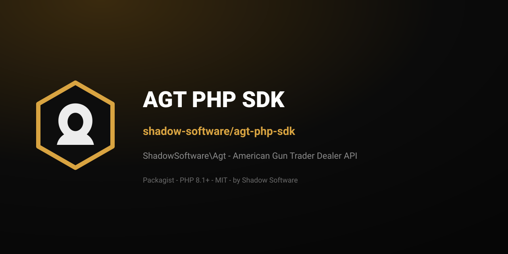

<p align="center">
  
</p>

<h1 align="center">AGT PHP SDK</h1>

<p align="center">
  <strong>Official PHP client for the
  <a href="https://americanguntrader.com/">American Gun Trader</a> Dealer API.</strong><br>
  Generated from OpenAPI — namespace <code>ShadowSoftware\Agt</code>.
</p>

<p align="center">
  <a href="https://packagist.org/packages/shadow-software/agt-php-sdk"></a>
  
  
  <a href="https://shadowsoftware.com/"></a>
</p>

<p align="center">
  <b><a href="https://packagist.org/packages/shadow-software/agt-php-sdk">Packagist →</a></b>
  &nbsp;·&nbsp;
  <a href="https://github.com/shadow-software/agt-for-woocommerce">WordPress plugin</a>
  &nbsp;·&nbsp;
  <a href="https://github.com/shadow-software/agt-sdk">TypeScript SDK</a>
</p>

---

## Install

```bash
composer require shadow-software/agt-php-sdk
```

Requires PHP 8.1+. Published on
[Packagist](https://packagist.org/packages/shadow-software/agt-php-sdk).

## Usage

```php
use ShadowSoftware\Agt\Configuration;
use ShadowSoftware\Agt\Api\DealerListingApi;

$config = Configuration::getDefaultConfiguration()
    ->setHost('https://americanguntrader.com')
    ->setAccessToken($accessToken);

$api = new DealerListingApi(null, $config);
```

Do **not** edit `generated/` by hand. Spec updates are regenerated by
[`shadow-software/sdk-release`](https://github.com/shadow-software/sdk-release)
and tagged releases update Packagist automatically.

## WordPress

The free
[AGT Sync for WooCommerce](https://github.com/shadow-software/agt-for-woocommerce)
plugin depends on this package (`^0.2`) and ships `vendor/` in its release ZIP.

## License

[MIT](LICENSE) © [Shadow Software LLC](https://shadowsoftware.com/).

---

## Also by Shadow Software

| | |
|---|---|
| [`shadow-software/dabdash-php-sdk`](https://github.com/shadow-software/dabdash-php-sdk) | DabDash Tenant API (PHP) |
| [`@shadow-software/agt-sdk`](https://github.com/shadow-software/agt-sdk) | AGT Dealer API (TypeScript) |
| [AGT Sync for WooCommerce](https://github.com/shadow-software/agt-for-woocommerce) | WordPress / WooCommerce plugin |

<p align="center">
  <sub><a href="https://shadowsoftware.com/">shadowsoftware.com</a> · MIT · © 2026 Shadow Software LLC</sub>
</p>
